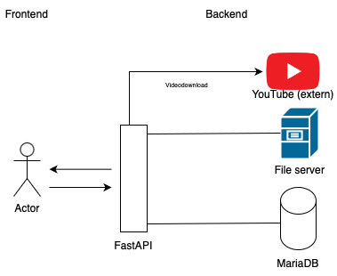

# Projektbericht YouTube Downloader
## Einleitung
Im Rahmen meines Wirtschaftsinformatik-/Data-Science-Studiums an der DHBW Heilbronn hatte ich im Fach „Verteilte Systeme“ die Möglichkeit, ein praxisnahes Projekt umzusetzen. Ziel war es, eine dynamische Webanwendung zu entwickeln, die externe Datenquellen integriert und verarbeitet. Konkret handelt es sich bei unserem Projekt um einen YouTube Video Downloader, der Videos in optimaler Qualität herunterlädt, Playlists unterstützt und auf der Website eine Übersicht der bisherigen Downloads des jeweiligen Accounts bietet. Darüber hinaus wurden Funktionen zur Anmeldung und Registrierung implementiert. So konnten wir die im Kurs vermittelten Konzepte gemeinsam direkt praktisch anwenden.

Mein persönlicher Beitrag lag in der Ausarbeitung des Projektberichts sowie in der Einrichtung und Strukturierung der ursprünglichen MariaDB-Datenbank. Im weiteren Verlauf des Projekts wurde die Datenbankanbindung jedoch auf SQLAlchemy umgestellt, was uns eine flexiblere und effizientere Handhabung der Daten ermöglichte.

Gemeinsam mit meinem Projektteam haben wir uns für eine Architektur entschieden, die auf einem FastAPI-Backend, einer MariaDB-Datenbank und einem HTML-Template-Frontend basiert. Die Anbindung an die Datenbank erfolgt über SQLAlchemy, was die Arbeit mit den Daten für uns deutlich vereinfacht. Die Anwendung folgt dem Model-View-Controller-Prinzip, das wir ebenfalls im Kurs behandelt haben: Das Backend verwaltet die Nutzerdaten und verarbeitet die YouTube-Links, während das Frontend eine benutzerfreundliche Oberfläche bereitstellt.

Das Projektteam, bestehend aus Jan Lau, Marius Lüdtke und Jan Schneeberg, dokumentiert im Folgenden die Projektarchitektur, den Entwicklungsprozess sowie unsere wichtigsten Entscheidungen und Erkenntnisse. Marius Lüdtke wird stellvertretend für unsere Gruppe den Code mit dem GitHub-Projekt hochladen. Das im GitHub-Projekt angehängte KI-Blatt gilt ebenfalls für den Projektbericht.

## Projektbericht

### Architektur

Für unser Projekt haben wir eine verteilte Architektur entworfen, die auf einer klaren Trennung von Frontend und Backend basiert. Das Backend bildet eine FastAPI-Anwendung, die auf einer vorhandenen Dokumentation basiert und grundlegend von Marius Lüdtke entsprechend angepasst und erweitert wurde. Über definierte API-Endpunkte werden Anfragen verarbeitet, die es ermöglichen, YouTube-Videos anhand einer URL herunterzuladen. Das Frontend basiert auf einem Projekt von Jan Schneeberg aus dem Modul Webprogrammierung im dritten Semester bei Tessa Steinigke. Es wurde als klassische HTML-Oberfläche umgesetzt und durch den Einsatz von CSS und JavaScript um ein strukturiertes Layout und interaktive Elemente erweitert. Die Seite nutzt Templates, um Benutzereingaben dynamisch zu erfassen und an das Backend weiterzuleiten. Diese Templates wurden von Marius Lüdtke gezielt um zentrale Funktionen wie Login/Registrierung, den Playlist Downloader sowie zusätzliche Designelemente ergänzt.

Über ein einfaches Formular – wahlweise für den Video-Downloader oder Playlist-Downloader – kann eine YouTube-URL eingetragen werden, die anschließend vom Backend verarbeitet wird. Die Kommunikation zwischen Frontend und Backend erfolgt dabei über verschiedene HTTP-Requests, die jeweils bestimmte Funktionen auslösen. Für das Abrufen von Daten kommt ein GET-Request zum Einsatz. Dieser ermöglicht es dem Frontend, Informationen vom Backend zu beziehen, ohne dabei Daten zu verändern – etwa beim Anzeigen von Benutzerdaten. Wenn Nutzer hingegen aktiv Daten eingeben, beispielsweise bei der Registrierung oder Anmeldung, wird ein POST-Request verwendet. Dabei werden die eingegebenen Informationen an das Backend gesendet, wo sie verarbeitet und – im Erfolgsfall – in der Datenbank gespeichert werden. Das Backend gibt anschließend eine Bestätigung oder eine Fehlermeldung zurück, abhängig davon, ob die Eingabe korrekt und gültig war.

In unserem Projekt lag der Fokus darauf, Benutzerdaten und Metainformationen zu den Downloads strukturiert zu speichern – die Video-Dateien selbst werden bewusst nicht in der Datenbank abgelegt, sondern im lokalen Dateisystem gespeichert. So bleibt die Datenbank schlank, und die Performance wird nicht eingeschränkt. Die Datenhaltung erfolgt über eine relationale MariaDB-Datenbank, die wir über SQLAlchemy angebunden haben. Die Struktur umfasst drei zentrale Tabellen: users, videos und playlists. Darüber hinaus gibt es drei Verknüpfungstabellen für viele-zu-viele-Beziehungen: user_videos, user_playlists und playlist_videos.

In der Tabelle users speichern wir u. a. den Benutzernamen (username), optional den vollständigen Namen (full_name) sowie die gehashte Version des Passworts (hashed_password). Zusätzlich kann ein Nutzer über das Feld disabled deaktiviert werden. Über die zugehörigen Beziehungstabellen sind jedem Nutzer sowohl einzelne Videos als auch ganze Playlists zugeordnet. Die Tabelle videos enthält für jedes Video eine interne ID, die zugehörige YouTube-Video-ID, den Titel, das Format (z. B. MP4 oder MP3) und einen Zeitstempel (created_at). Dies erlaubt uns nicht nur die Zuordnung zu Nutzern und Playlists, sondern auch eine klare Protokollierung, wann ein Video heruntergeladen wurde. Die Tabelle playlists speichert ähnliche Metadaten – etwa den Titel, die Beschreibung sowie die zugehörige YouTube-Playlist-ID. Die Beziehung zwischen Playlists und Videos wird über die Tabelle playlist_videos abgebildet, die zusätzlich auch die Reihenfolge einzelner Videos innerhalb einer Playlist enthält. Das ursprünglich im System vorgesehene Download-Limit pro Nutzer wird über die Verknüpfung von Nutzern und Videos in user_videos verwaltet. Wird dieses Limit überschritten, entfernt das System automatisch die ältesten Einträge – sowohl in der Datenbank als auch im Dateisystem –, um Platz für neue Downloads zu schaffen.

Die zentralen Technologien, die wir in diesem Projekt verwendet haben, sind:
- FastAPI, das Backend-Framework, mit dem wir schnell eine API entwickelt haben.
- yt-dlp, eine Library, mit der wir YouTube-Videos und -Playlists verarbeiten und herunterladen können.
- SQLAlchemy, das als ORM dient und die Anbindung unserer MariaDB-Datenbank ermöglicht.
- HTML, CSS und JavaScript, um die Weboberfläche zu gestalten und eine benutzerfreundliche Erfahrung zu bieten.
- MariaDB, unser Datenbanksystem zur Speicherung strukturierter Metainformationen über Nutzer, Videos und Playlists.
- Docker, das uns geholfen hat, die Anwendung zu containerisieren und so eine einfachere Bereitstellung und Isolierung zu ermöglichen.

### Skizze des verteilten Systems

Unsere Architektur lässt sich wie folgt zusammenfassen:
- Actor: Der Webbrowser des Nutzers, der HTTP-Requests mit der YouTube-URL an das System sendet.
- Frontend: Ein HTML-Template, das ein einfaches Formular enthält, um die YouTube-URL an das Backend zu übermitteln.
- API Layer: Eine REST-API, die als Schnittstelle zwischen Frontend und Backend fungiert und die Kommunikation ermöglicht.
- Backend: Der FastAPI-Server, der die übermittelte URL verarbeitet, das Video oder die Playlist über yt-dlp herunterlädt und mit FFmpeg konvertiert.
- Speicherung: Die Videos werden im lokalen Dateisystem des Servers abgelegt, während die Benutzer- und Downloadinformationen in einer MariaDB-Datenbank gespeichert werden.
- Externe Quelle: YouTube-Server, von denen die eigentlichen Videodaten abgerufen werden.

Zusammengefasst verbindet unser System also verschiedene interne Komponenten, vom Frontend über die API bis hin zum Backend und der Datenbank, mit der externen Quelle YouTube.

### Vorgehensweise

#### Frontend
Zu Beginn haben wir uns intensiv mit der API-Definition auseinandergesetzt. Unser Ziel war es, die Nutzung für die Endanwender so einfach wie möglich zu gestalten, falls das System später produktiv eingesetzt werden sollte. Daher haben wir uns entschieden, ein einfaches und übersichtliches HTML-Frontend zu entwickeln, das die Nutzer intuitiv durch die Anwendung führt. Für den Video- und Playlist-Download haben wir das Frontend bewusst minimalistisch gehalten: Es enthält nur ein Eingabefeld, in dem Nutzer die YouTube-URL eintragen können, und einen Download-Button, der die Aktion auslöst.
Zusätzlich haben wir ein einfaches Login- und Registrierungssystem implementiert, das den Nutzern eine unkomplizierte Anmeldung mit Nickname und Passwort ermöglicht. Die Eingabe von E-Mail-Adresse und vollständigem Namen ist dabei optional gehalten.

#### Backend
Im Backend haben wir die FastAPI-Anwendung modular aufgebaut, um das System übersichtlich und flexibel zu gestalten.
- Routen: Sie übernehmen die Verarbeitung der Nutzeranfragen und leiten diese an die passenden Servicefunktionen weiter.
- Services: Hier steckt die eigentliche Logik: Mit yt-dlp laden wir Videos oder Playlists herunter. Dabei wird automatisch das jeweils beste verfügbare Videoformat ausgewählt.
- Templates: Sie sind verantwortlich für die Darstellung der Eingabefelder und Benachrichtigungen, die den Nutzer über den Fortschritt der Downloads oder auftretende Fehler informieren.

Für die Fehlerbehandlung haben wir HTTP-Statuscodes verwendet, um dem Nutzer im Falle von Problemen, wie etwa einer ungültigen URL, Authentifizierungsfehlern oder Problemen beim Herunterladen, schnell und transparent eine Rückmeldung zu geben. Darüber hinaus haben wir im Backend spezielle Exception-Handler eingebaut, die dazu dienen, Fehler wie das Erreichen von Speichergrenzen oder fehlerhafte API-Aufrufe zu erfassen und entsprechende Fehlermeldungen zurückzugeben.
Ein besonders wichtiges Feature unseres Systems ist die Speicherverwaltung: Für jeden Nutzer haben wir ein Download-Limit definiert. Sobald dieses Limit erreicht ist, sorgt das System automatisch dafür, dass die ältesten Downloads gelöscht werden, um Platz für neue zu schaffen. Das hilft uns, die Ressourcen effizient zu nutzen und die Performance des Systems hoch zu halten.
Abschließend haben wir die Datenbank (MariaDB) mithilfe von Docker containerisiert. Dies ermöglicht uns eine einfache Bereitstellung und Verwaltung der Datenbank, unabhängig von der zugrunde liegenden Infrastruktur. Durch den Einsatz von Docker-Compose konnten wir sicherstellen, dass die Datenbank in einer isolierten Umgebung läuft, was die Verwaltung und Skalierbarkeit der Anwendung wesentlich vereinfacht.

#### Agiles Arbeiten

Ein zentraler Bestandteil unserer Vorgehensweise war das agile Arbeiten im Team. Um den Überblick zu behalten, haben wir das integrierte GitHub Kanban Board genutzt, auf dem alle Aufgaben, Features und Bugs transparent erfasst wurden. Die Aufgaben wurden fair verteilt, wobei wir uns intensiv darüber abgestimmt haben, wer welche Verantwortung übernimmt – basierend auf den individuellen Stärken und Kapazitäten jedes Einzelnen. Besonders hilfreich war dabei unsere gemeinsame Aufwandsschätzung, bei der wir mit einem einfachen Punktesystem (z. B. 2, 5, 7 oder 17 Punkte) den erforderlichen Arbeitsaufwand jeder Aufgabe bewertet haben. Diese Einschätzungen halfen uns, das Projekt regelmäßig zu priorisieren und flexibel auf neue Anforderungen zu reagieren.

Für die Kommunikation nutzten wir Discord, sodass wir auch außerhalb der regulären Treffen schnell und unkompliziert miteinander in Kontakt bleiben konnten – sei es per Chat, Anruf oder Bildschirmfreigabe. Diese Arbeitsweise ermöglichte uns eine strukturierte und zugleich flexible Zusammenarbeit, bei der jede Person ihren Aufgabenbereich eigenverantwortlich bearbeitete und die Ergebnisse anschließend im Team durch gegenseitige Reviews abgesichert wurden. Rückblickend fühlte sich dieses Vorgehen sehr nah an agilem Arbeiten im kleinen Maßstab an und stellte zudem eine spannende Parallele zu meinen Erfahrungen aus der Praxisphase im dualen Studium dar.

Abschließend haben wir großen Wert auf eine klare Trennung der Zuständigkeiten gelegt, sowohl im Code (Trennung von Logik, Datenhaltung und Darstellung) als auch in der Systemarchitektur (Trennung von Frontend, API-Layer, Backend-Services und externen Quellen). Dieses strukturierte Vorgehen entspricht den Best Practices moderner verteilter Systeme und legt eine solide Basis für zukünftige Erweiterungen oder produktive Einsätze.

### Getroffene Entscheidungen, Annahmen und Limitationen

#### Entscheidungen:
1.	Wir haben uns aufgrund der Aktualität und Einfachheit des Frameworks bewusst für FastAPI entschieden, um eine schnelle und asynchrone API zu entwickeln, die sowohl performante als auch skalierbare Lösungen ermöglicht. 
2.	Für den Download von YouTube-Videos haben wir yt-dlp gewählt, da diese aktiv gepflegte Library eine einfache Handhabung bietet und sehr gut dokumentiert ist.
3.	Die Speicherung der Videodateien erfolgt bewusst im lokalen Dateisystem, während wir die Metadaten wie Downloadzeitpunkte und Nutzerinformationen in einer MariaDB-Datenbank ablegen. Diese Trennung sorgt dafür, dass die Datenbank schlank bleibt und die Videos effizient verwaltet werden.
4.	Bei der Architektur haben wir uns für eine klare Trennung von Frontend, API-Layer und Backend entschieden. Diese Struktur verbessert nicht nur die Wartbarkeit, sondern ermöglicht auch eine parallele Teamarbeit an den einzelnen Komponenten.
5.	Teile vom Projekt wurden mithilfe von Docker containerisiert, um eine konsistente Entwicklungsumgebung zu schaffen.
6.	Für die Projektorganisation und Aufgabenverteilung haben wir das GitHub Kanban Board verwendet, um alle Aufgaben transparent zu koordinieren, den Arbeitsaufwand realistisch zu schätzen und flexibel auf Änderungen und neue Anforderungen zu reagieren.
7.	Die Entscheidung, das System zunächst nur lokal und nicht öffentlich zugänglich zu machen, wurde bewusst getroffen. Dadurch konnten wir Sicherheitsrisiken, Hosting-Komplexität und rechtliche Fragen (Youtube-Richtlinien) im ersten Schritt vermeiden.
8.	Das Download-Limit pro Nutzer wurde so konzipiert, dass das System automatisch alte Dateien löscht, sobald das Limit erreicht ist. Diese Entscheidung sorgt dafür, dass Speicherplatz effizient verwaltet wird, ohne dass der Nutzer manuell eingreifen muss.

#### Annahmen:
1. Es wird vorausgesetzt, dass die Nutzer ("Actors") eine stabile Internetverbindung haben, da der Download von externen Servern erfolgt und relativ Speicherintensiv ist.
2. Die heruntergeladenen Dateien verletzen eventuell Urheberrechte. Deshalb gehen wir davon aus, dass die Anwendung ausschließlich zu privaten, nicht-kommerziellen Zwecken genutzt wird und die Nutzer eigenverantwortlich handeln.
3. Es wird davon ausgegangen, dass Nutzer nur gültige YouTube-Links eingeben und dass die Inhalte öffentlich oder zumindest nicht privat gelistet sind. Eine umfassende Überprüfung der YouTube-URL oder des Videostatus (etwa Verfügbarkeit oder Altersfreigabe) erfolgt auf Serverseite nur eingeschränkt. Da yt-dlp Cookies benötigt, um YouTube zu authentifizieren und nicht als Bot erkannt zu werden, sind solche Aspekte wie Altersbeschränkungen oder versteckte Inhalte nur bedingt abgedeckt.
4. Das System wird in einer lokalen, kontrollierten Entwicklungsumgebung ausgeführt, in der alle benötigten Komponenten (Datenbank, Docker, yt-dlp) fehlerfrei installiert und lauffähig sind. Fehler, die aus Umgebungskonflikten oder Betriebssystemunterschieden entstehen, wurden nicht systematisch abgefangen.
5. Es wird vorausgesetzt, dass ausreichend Festplattenspeicher auf dem Server zur Verfügung steht und keine administrativen Einschränkungen beim Datei- oder Netzwerkzugriff bestehen.

#### Limitationen:
1. Der Dienst unterstützt aktuell nur den Download einzelner Videos oder Playlists, keine Livestreams oder privat gelistete YouTube-Inhalte.
2. Unser System unterstützt ausschließlich den Download einzelner Videos/Playlists. Komplexere Downloadfunktionen sind leider nicht implementiert.
3. Der Betrieb ist aktuell auf lokale Umgebungen ausgelegt. Für einen produktiven Einsatz müsste ein geeignetes Hostingkonzept entwickelt werden.
4. Es fehlt aktuell eine Benutzerverwaltung mit Passwort Reset oder Rollenverteilung (z. B. Admin versus Nutzer).
5. Da Downloads synchron verarbeitet und lokal gespeichert werden, könnte es bei mehreren parallelen Nutzern schnell zu Engpässen oder Speicherproblemen kommen.
6. Fehlerbehandlungen werden hauptsächlich über allgemeine HTTP-Statuscodes abgewickelt. Detaillierte Rückmeldungen für Nutzer oder automatisierte Monitoring-Mechanismen wurden in diesem Projekt jedoch noch nicht integriert.

#### Ausblick über notwendige zukünftige Arbeiten

Langfristig wäre eine Erweiterung unseres Systems sinnvoll:
- Unterstützung weiterer Plattformen neben YouTube, z. B. Spotify, SoundCloud oder Apple Music.
- Funktionen wie Passwortzurücksetzung und differenzierte Nutzerrollen (Admin vs. Standardnutzer).
- Auslagerung des Speichers in skalierbare Cloud-Lösungen wie AWS S3 oder Azure Blob Storage.
- Erweiterung um Continuous-Integration-Pipelines (z. B. GitHub Actions) zur Automatisierung des Deployments.
- Betrieb auf Cloud-Plattformen wie Railway oder Fly.io zur vereinfachten Bereitstellung.
- Deployment des gesamten Systems in Containern (Docker) zur besseren Skalierbarkeit und Wartung.
- Erweiterung durch die Möglichkeit, das Format der heruntergeladenen Videos flexibel über FFmpeg auszuwählen.
- Verbesserte Benutzeroberfläche mit Ladebalken, Status- und Fortschrittsanzeigen.
- Suchfunktion und eine erweiterte Download-Historie für Nutzer.
- Benachrichtigungsfunktionen per E-Mail oder Push-Nachrichten.
- Integration von Analytics-Diensten zur Nutzungsauswertung und Optimierung.

## Schluss 
Die Umsetzung des Projekts half mir, das in der Vorlesung Gelernte praktisch anzuwenden und ein besseres Verständnis für die Herausforderungen verteilter Systeme zu entwickeln. Besonders spannend fand ich die Kombination aus einer REST-basierten API, der Anbindung an externe Datenquellen wie YouTube, welche heutzutage fast jeder verwendet, und einer funktionalen Weboberfläche. Beeindruckend fand ich, wie schnell sich mit FastAPI ein funktionierender Prototyp erstellen ließ. Gleichzeitig wurde mir bewusst, wie stark solche Systeme von externen Bibliotheken wie yt-dlp abhängen und wie schnell Änderungen auf Plattformen wie YouTube die Funktionalität beeinflussen können.

Im Team lernte ich den Wert einer Aufgabenverteilung und einer modularen Projektstruktur zu schätzen. Zur besseren Koordination nutzten wir ein GitHub Kanban Board, auf dem Aufgaben definiert, priorisiert und zugewiesen wurden. Dadurch erhielt unsere Projektorganisation – im Vergleich zu klassischen Hochschulprojekten – realistische und fast schon professionelle Züge. Die konsequente Trennung von Frontend, API-Schicht, Backend-Logik und Datenhaltung ermöglichte effizientes Arbeiten und optimale Ergänzung im Team. Nach Abschluss der Aufgaben überprüften wir gegenseitig die Ergebnisse, wodurch agiles Arbeiten im kleinen Maßstab entstand – eine interessante Parallele zur Praxisphase im restlichen Studium. 

Rückblickend habe ich mitgenommen, wie wichtig saubere Schnittstellen, stabile externe Abhängigkeiten und durchdachte Fehlerbehandlung sind. Außerdem zeigte sich, wie viel man mit überschaubarem Code erreichen kann, wenn die Systemarchitektur gut gewählt ist. Für zukünftige Projekte möchte ich vor allem die Containerisierung mit Docker und das Deployment in Cloud-Umgebungen vertiefen, um Systeme stabiler und skalierbarer zu gestalten.

## Aufgabenverteilung 
Die Umsetzung des Projekts erfolgte mit folgender Aufgabenverteilung:

Jan Lau war verantwortlich für die Ausarbeitung des Projektberichts sowie die Einrichtung und Strukturierung der ursprünglichen MariaDB-Datenbank. Im weiteren Verlauf des Projekts wurde die Datenbankanbindung auf SQLAlchemy umgestellt.

Marius Lüdtke ergänzte die bestehende Website um die Funktionen zum Einloggen und Registrieren von Nutzern und gestaltete das Frontend neu. Zudem passte Marius Lüdtke das Backend entsprechend an, um die neuen Features in die bestehende Struktur zu integrieren.

Jan Schneeberg entwickelte eine eigenständige Bibliothek zur Verarbeitung von YouTube-Links, inklusive der Download-Logik mit YT-DLP für Einzelvideos und Playlists sowie der anschließenden Dateikonvertierung mit FFmpeg. Diese wurde später durch die Python-YouTube-DLP-Library ersetzt, wodurch die Dateikonvertierung mittlerweile automatisch erfolgt. Zudem übernahm Jan Schneeberg Projektmanagement-Aufgaben und koordinierte den Ablauf.

Jedes Teammitglied verfasste zusätzlich den eigenen Einleitungstext sowie den individuellen Schlussteil, wie in der Prüfungsleistung vorgesehen.
